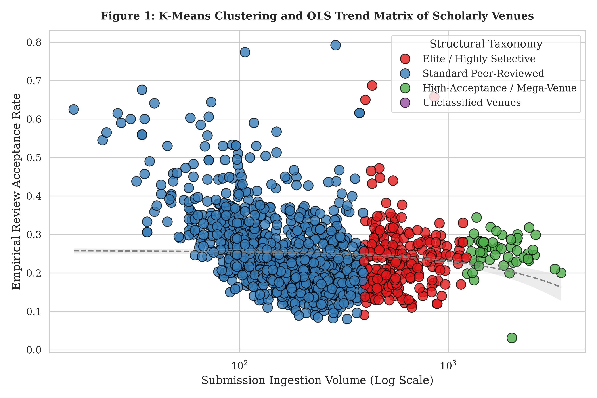
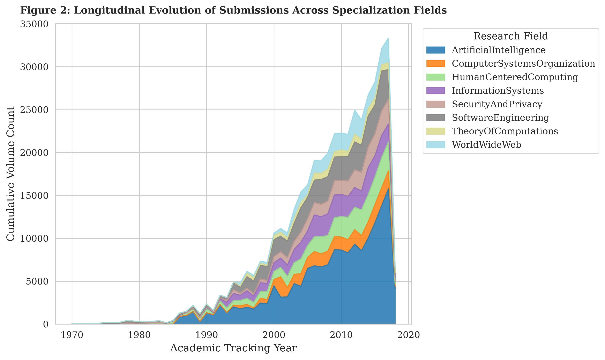
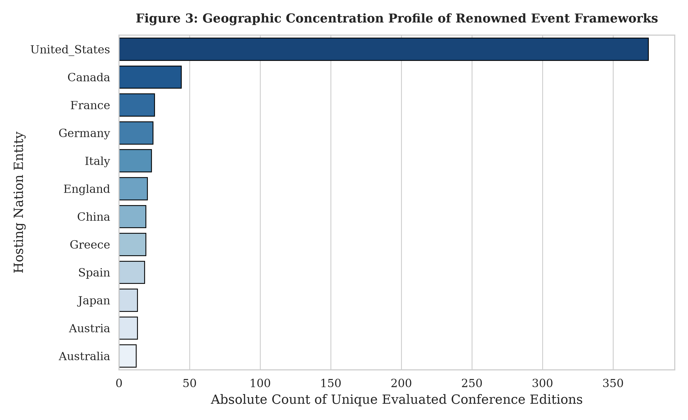
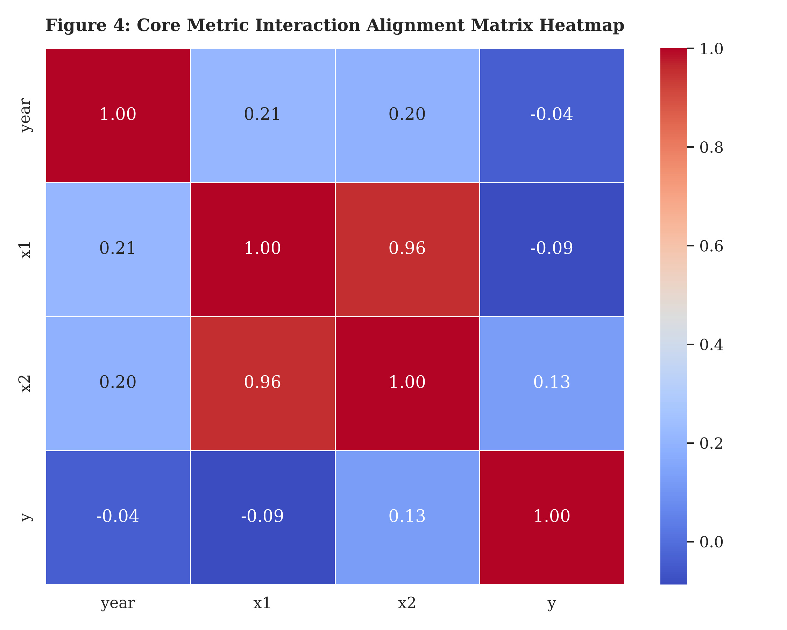
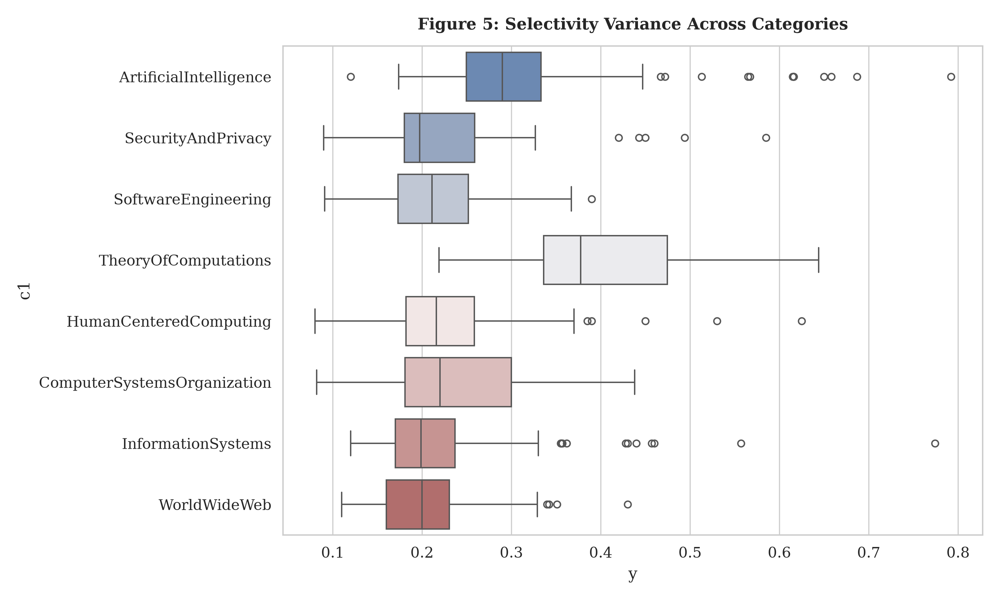
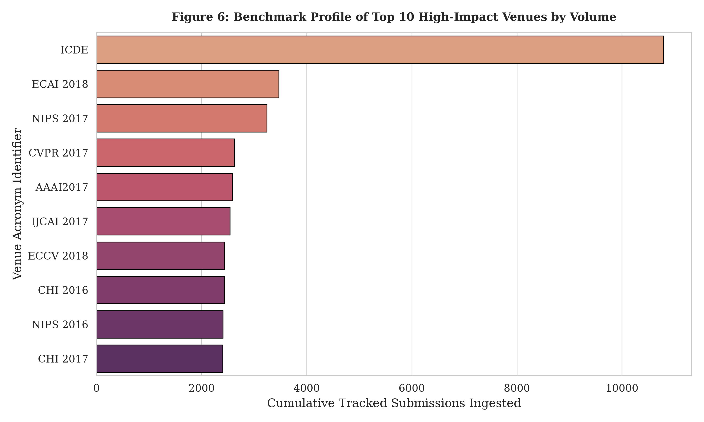
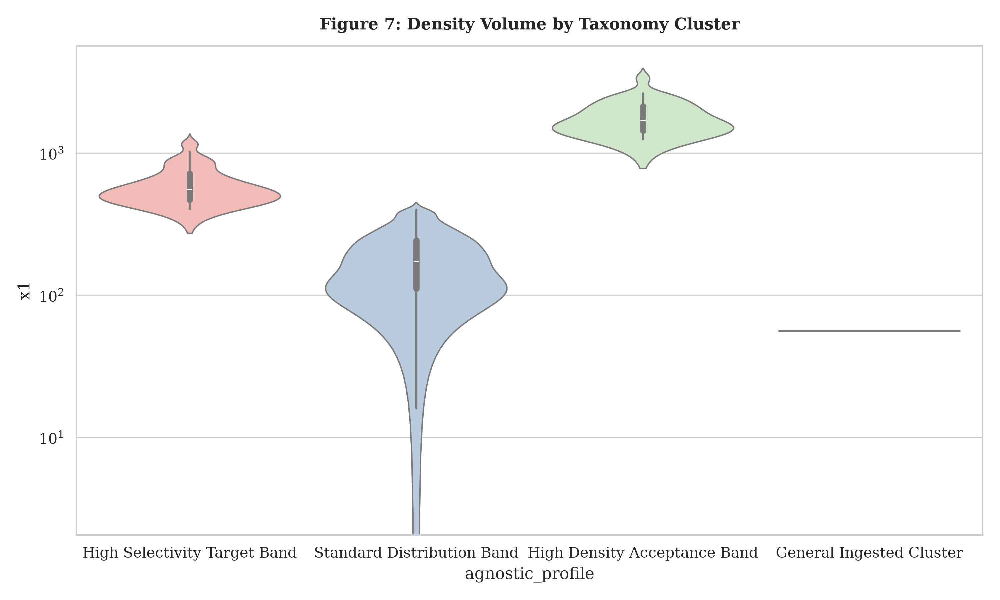

[](https://opensource.org/licenses/MIT)
[](https://www.python.org/downloads/release/python-3120/)
[](https://github.com/saidfathalla/GraphLens/actions)
[](https://www.go-fair.org/fair-principles/)
[](https://www.w3.org/RDF/)

# GraphLens: Automated Semantic Graph Scientometric Pipeline

GraphLens is an automated, single-command command-line framework engineered to bridge the operational gap between structured semantic web repositories (RDF/Scholarly Knowledge Graphs) and advanced statistical scientometric analysis. 

Rather than requiring researchers to manually construct, debug, and optimize complex, resource-intensive federated SPARQL queries, GraphLens wraps the entire data engineering, feature vectorization, unsupervised machine learning, and visualization lifecycle within a headless execution loop.

## Features

* **Autonomous Layout Heuristics Engine**: Utilizes an integrated text-based machine learning pipeline (`CountVectorizer` + `DecisionTreeClassifier`) to bootstrap layout heuristics and classify column structures.
* **Multi-Dimensional Graph Ingestion**: Streams remote or local open-world triplestores natively via `rdflib`, executing graph-flattening query configurations to bypass nested property paths.
* **Mathematical Imputation & Cross-Derivation**: Automatically resolves missing open-world metadata literals by cross-calculating dependent peer-review statistics (e.g., mathematically inferring missing `accepted`, `submitted`, or `acceptanceRate` data points) to maximize observation sample sizes.
* **Unsupervised Taxonomic Profiling**: Applies $K$-means clustering ($K=3$) over continuous selectivity boundaries to automatically segment venues into standardized behavioral tiers (*Elite / Highly Selective*, *Standard Peer-Reviewed*, and *High-Acceptance / Mega-Venue*).
* **Longitudinal Growth Trajectory Regression**: Embeds parallel Ordinary Least Squares (OLS) linear regression configurations to compute annual growth velocities and trend fit coefficients ($R^2$) across multi-decade timeline horizons.
* **Automated Production Asset Materialization**: Systematically exports an entire suite of 7 high-density, journal-ready visualization plots (300 DPI, serif-typed) and a unified data matrix without manual plotting configurations.

## Installation

### Prerequisites
* Python 3.8+
* `pip` package manager
* Virtual environment framework (`venv` or `conda`, recommended)

### Core Dependencies
The pipeline engine automatically manages or builds upon the following foundational semantic and analytical runtimes:
* **`rdflib`**: For core W3C RDF parsing, graph manipulation, and Turtle serialization.
* **`pandas` & `numpy`**: For optimized structural array indexing, matrix cleaning, and data framing operations.
* **`scikit-learn`**: For internal ML layout classification, $K$-means data clustering, and OLS regression modeling.
* **`matplotlib` & `seaborn`**: For rendering high-impact, publication-ready statistical visualizations in headless environments.

### Install dependencies:
We recommend using a virtual environment.

```bash
pip install requests numpy pandas matplotlib seaborn rdflib scikit-learn
```

## Usage
GraphLens is designed as an automated, single-command command-line tool. Run the main script file to execute the pipeline:

```bash
python3 graphlens.py
```

By default, the pipeline automatically connects to the live open-science E[VENTSKG-Dataset](https://raw.githubusercontent.com/saidfathalla/EVENTSKG-Dataset/refs/heads/master/EVENTSKG.ttl) turtle data channel, 
compiles the semantic schemas, runs the advanced analytics core, and routes all outputs directly to `output/`.


## Outputs

Upon execution, the GraphLens engine automatically writes the unified analytical matrix and 7 journal-optimized visual assets directly into the `output/` directory. 

### Unified Data Artifact
* 📊 **[processed_scientometric_matrix.csv](output/processed_scientometric_matrix.csv)**: The structural unified dataset matrix compiling cleaned features, mathematically imputed metrics, and nominal taxonomical cluster assignments.

### Materialized Visual Assets

#### 1. Venue Behavioral Taxonomy & OLS Trajectory
Maps venue intake volumes against metric acceptance rates categorized via unsupervised $K$-Means clustering and overlaid with an Ordinary Least Squares (OLS) longitudinal trend curve.


#### 2. Longitudinal Field Growth Profile
A stacked area matrix tracing the total macro-scale thematic distributions across research domains over multi-decade timelines.


#### 3. Geographic Concentration Distribution
A comparative profile illustrating the geographic host asymmetry and regional densities of international scientific tracking instances.


#### 4. Feature Dependency Matrix
A correlation heatmap illustrating Pearson linear dependency indices between temporal progression, submission scales, and selectiveness constraints.


#### 5. Cross-Domain Selectivity Variance
Utilizes horizontal boxplots to map inner quartiles, median selectivity boundaries, and peer-review outlier thresholds across scientific fields.


#### 6. Core Venue Benchmark Ranking
An evaluation benchmark ranking the top ten most active publication series and venue tracks based on cumulative ingestion volume.


#### 7. Cluster Submission Volume Densities
Log-scaled kernel density violin profiles exposing the explicit submission volume thresholds and structural cutoffs separating the venue classes.



## Testing & Quality Assurance

GraphLens includes a robust testing framework powered by `pytest` to ensure that data transformation layers, semantic cleaning routines, and machine learning components remain completely accurate and deterministic across code changes. A Continuous Integration (CI) pipeline is configured via GitHub Actions to automatically execute the test suite on every code push or pull request.

### Running Tests Locally

To install the testing requirements and run the validation suite on your local machine, execute the following commands in your terminal:

```bash
python3 -m pytest
```

### Test Suite Architecture

The validation framework runs automated isolation tests against the primary data engineering layers inside `graphlens.py`:

* **Data Type Coercion:** Verifies that heterogeneous open-world literal formats returned from the SPARQL endpoint are successfully cast into standardized mathematical arrays (`float64` and `int64`).
* **Regex Date Extraction:** Assures that variable event timestamps and unstructured date strings are accurately isolated into uniform academic tracking years.
* **Missing-Value Imputation Logic:** Validates the mathematical cross-derivation algorithm to guarantee that inferred metrics (such as reconstructing missing `acceptanceRate` data points from known paper counts) are solved without injecting calculation bias.
* **Pipeline Integrity:** Uses a minimal, synthetic RDF graph payload to evaluate the end-to-end execution of the $K$-means partitioning engine and the Ordinary Least Squares (OLS) trend computation loop.

### Citation
If you use TAGS in your research, please cite our paper:

TBD.

### License
Distributed under the MIT License. See the `LICENSE` file in the root directory for more information.


